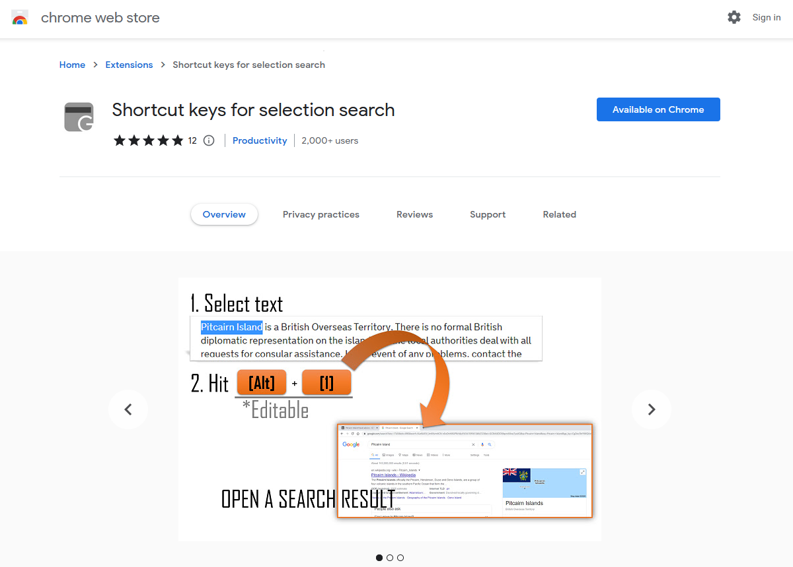
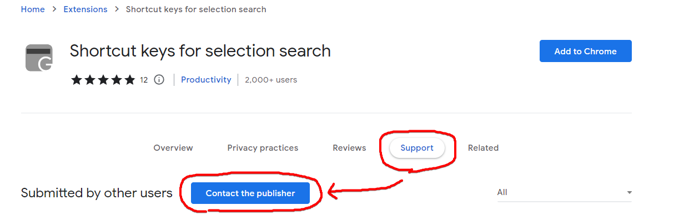

# Shortcut keys for selection search

## About
This is a Chrome Extension published in [Chrome Web Store](https://chrome.google.com/webstore/detail/shortcut-keys-for-selecti/emceciddhgnjkmjmpjoahmdhibmifohp).

For Windows/Mac/Linux/Chromebook

## Features

- Search selected text by Google
- Search selected text by a default search engine
- Work on PDF *(in development)*

Below shortcut keys can be set, edit or delete in `chrome://extensions/shortcuts`, or in the setting menu in *More tools -> Extension ->* above left menu button *-> Keyboard shortcuts*.
1. `Alt(Option) + 1` => Search in Google in a new foreground tab
1. `Alt(Option) + Shift + 1` => Search in Google in a new background tab
1. `none` => Search in default search engine in a new tab
1. `none` => Search in default search engine in a new window
1. `none` => Search in default search engine in the current window

## Caution

**For Chromebook or Mac OS users**
The Alt+1 key will click the first icon in the Shelf, and it will not work on Chrome browser.
After the installation,  please change the shortcut key from "Alt+1" to another one at chrome://extensions/shortcuts then avoid the built-in shortcut keys on your OS.
In the setting page, the right box should be "In Chrome".
(Input chrome://extensions/shortcuts in the address bar and press Enter to open a setting page.)

## Feedback

Please tell me your problems or suggestions via *Support -> Contact the publisher* on [web store](https://chrome.google.com/webstore/detail/shortcut-keys-for-selecti/emceciddhgnjkmjmpjoahmdhibmifohp).

Also kindly welcome to post issues and or pull requests on [GitHub](https://github.com/sa-ji/Shortcut-keys-for-selection-search/issues).

## Review
Thanks for your kind reviews!

